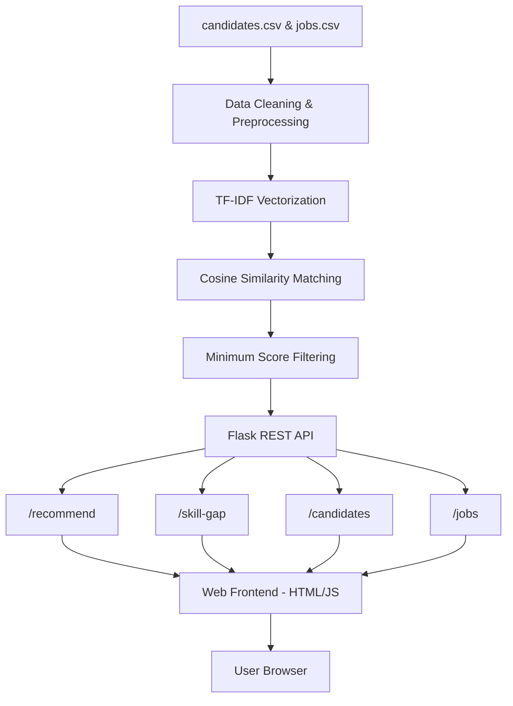
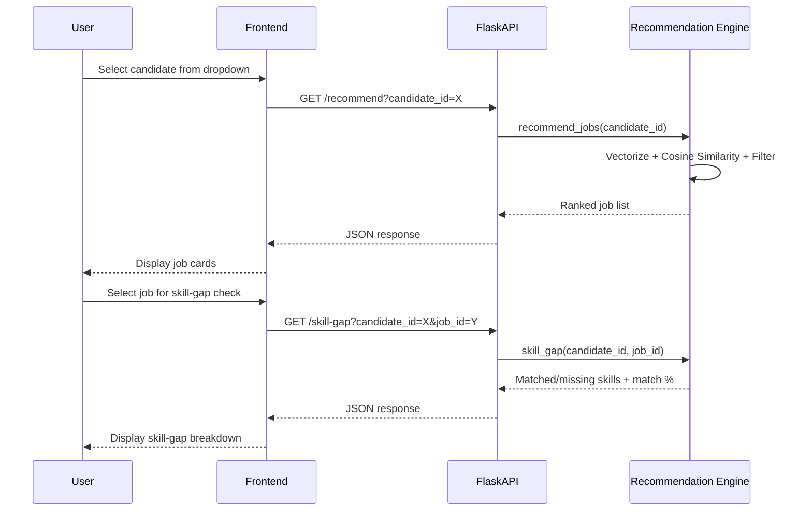

# ShaktiSeva – AI-Based Job Recommendation System

ShaktiSeva is a skill-based job recommendation engine that matches candidates to relevant job openings using Natural Language Processing and similarity-based matching. It goes beyond simple matching by also explaining *why* a recommendation was made and *what's missing* for jobs a candidate doesn't fully qualify for.

---

## Table of Contents

- [Problem Statement](#problem-statement)
- [Features](#features)
- [Tech Stack](#tech-stack)
- [System Architecture](#system-architecture)
- [How It Works](#how-it-works)
- [Project Structure](#project-structure)
- [API Endpoints](#api-endpoints)
- [Setup & Installation](#setup--installation)
- [Evaluation](#evaluation)
- [Future Improvements](#future-improvements)
- [Author](#author)

---

## Problem Statement

Traditional job portals rely heavily on keyword search, which often misses relevant matches when candidates and job postings describe similar skills differently. ShaktiSeva solves this by representing skills as numeric vectors and using similarity scoring to find genuinely relevant matches — even when exact keywords don't align — while also giving candidates actionable feedback on skill gaps.

---

## Features

- **Skill-Based Job Matching** — Recommends jobs using TF-IDF vectorization and cosine similarity, not plain keyword search
- **Skill Gap Analysis** — Shows exactly which skills a candidate has, and which they're missing, for any specific job
- **REST API** — Built with Flask, exposing clean endpoints for recommendations, skill-gap analysis, and data browsing
- **Interactive Web UI** — Dropdown-based frontend so users pick candidates/jobs by name, not by memorizing IDs
- **Quality Filtering** — Only returns recommendations above a minimum similarity threshold, avoiding weak or irrelevant matches
- **Evaluation Metrics** — Includes a Precision@k script to measure recommendation quality against a labeled test set

---

## Tech Stack

| Layer | Technology |
|---|---|
| Backend | Python, Flask |
| ML / NLP | scikit-learn (TF-IDF Vectorizer, Cosine Similarity) |
| Data Handling | pandas, NumPy |
| Frontend | HTML, CSS, JavaScript (Fetch API) |
| Evaluation | Custom Precision@k script |

---

## System Architecture



### Architecture Explained

1. **Data Layer** — Structured candidate and job data is stored in CSV files (`candidates.csv`, `jobs.csv`), each containing an ID, name/title, and a list of skills.
2. **Preprocessing Layer** — Raw skill strings are cleaned: lowercased, split on commas/semicolons, and stripped of extra whitespace, so formatting inconsistencies don't affect matching.
3. **Feature Engineering Layer** — TF-IDF (Term Frequency–Inverse Document Frequency) converts each skill list into a numeric vector. Rare, distinguishing skills are weighted higher than common ones, so matches reflect meaningful overlap rather than generic keywords.
4. **Matching Layer** — Cosine similarity compares a candidate's vector against every job's vector, producing a similarity score between 0 and 1 for each job.
5. **Filtering Layer** — Only jobs above a minimum similarity threshold are returned, so the system doesn't surface weak, irrelevant matches.
6. **API Layer** — Flask exposes this logic through REST endpoints, decoupling the recommendation engine from any client that wants to use it.
7. **Frontend Layer** — A lightweight HTML/JavaScript interface calls the API and renders results as readable cards, with dropdowns populated dynamically from `/candidates` and `/jobs`.

---

## How It Works



---

## Project Structure

```
ShaktiSeva/
│
├── data/
│   ├── candidates.csv       # Candidate profiles with skills
│   └── jobs.csv             # Job postings with required skills
│
├── templates/
│   └── index.html           # Frontend UI (form + result display)
│
├── recommend.py              # Core ML logic: cleaning, TF-IDF, similarity, skill-gap
├── app.py                    # Flask application and API routes
├── evaluate.py                # Precision@k evaluation script
├── requirements.txt           # Python dependencies
└── README.md                  # Project documentation
```

---

## API Endpoints

| Endpoint | Method | Description |
|---|---|---|
| `/` | GET | Serves the web UI |
| `/recommend?candidate_id=&top_n=` | GET | Returns top-N job recommendations for a candidate |
| `/skill-gap?candidate_id=&job_id=` | GET | Returns matched/missing skills between a candidate and a job |
| `/candidates` | GET | Lists all candidates |
| `/jobs` | GET | Lists all jobs |

**Example request:**
```
GET /recommend?candidate_id=101&top_n=3
```

**Example response:**
```json
{
  "candidate_id": 101,
  "recommendations": [
    {"job_id": 201, "title": "Data Scientist", "match_score": 0.87},
    {"job_id": 211, "title": "Machine Learning Engineer", "match_score": 0.74}
  ]
}
```

---

## Setup & Installation

```bash
# Clone the repository
git clone https://github.com/yourusername/ShaktiSeva.git
cd ShaktiSeva

# Create and activate a virtual environment
python -m venv venv
source venv/bin/activate      # Mac/Linux
venv\Scripts\activate         # Windows

# Install dependencies
pip install -r requirements.txt

# Run the application
python app.py
```

Then open **http://127.0.0.1:5000/** in your browser.

---

## Evaluation

Recommendation quality is measured using **Precision@k** — of the top-k recommended jobs, how many are actually relevant, based on a manually validated ground truth set.

```bash
python evaluate.py
```

This prints per-candidate precision scores and an overall average, giving a concrete measure of recommendation quality rather than relying on similarity scores alone.

---

## Future Improvements

- Replace brute-force cosine similarity with **FAISS** for scalability to much larger candidate/job datasets
- Train a **supervised ranking model** (e.g., logistic regression) on historical accept/reject match outcomes instead of relying purely on similarity
- Add **resume parsing directly from PDFs**, so skills don't need to be manually entered into CSVs
- Add **authentication** for a production-ready, multi-user experience

---

